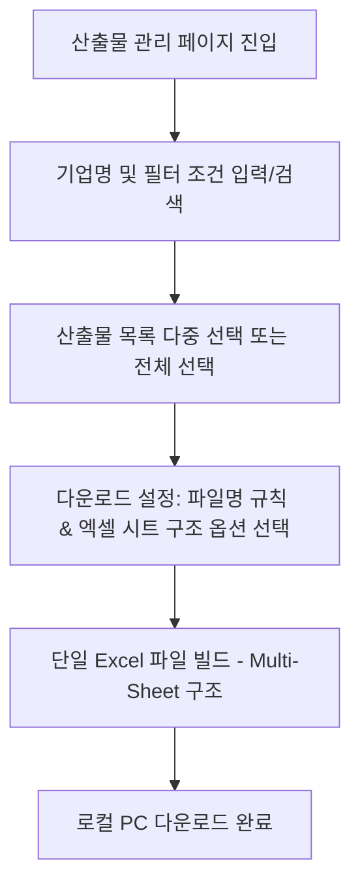

# 기업 산출물 관리 및 다중 다운로드 기능 기획안

이 문서는 사용자가 필요한 기업명을 검색하고 관련 산출물을 선택하여, 규칙 기반의 파일명 변환 및 **하나의 엑셀 파일 내 복수 시트(Sheet) 구조**로 맞춤 다운로드할 수 있는 **산출물 데이터 다운로드 기능**의 기획 아이디어와 상세 설계 방향을 정리한 문서입니다.

---

## 1. 핵심 사용자 흐름 (User Flow)

---

## 2. 엑셀 다중 시트(Multi-Sheet) 구조 설계 안

사용자가 하나의 엑셀 파일에서 모든 데이터를 일목요연하게 파악할 수 있도록, 다운로드 목적에 따른 세 가지 시트 분할 시나리오를 정의합니다.

### 📋 옵션 A: 데이터 유형별 분할 구조 (추천 - 데이터 분석 및 피벗 용이)
전체 데이터를 역할에 따라 분리하여 보관하며, 엑셀 내에서 데이터를 필터링하거나 가공하기에 가장 적합한 구조입니다.

*   **Sheet 1: `[요약] 총괄 현황`**
    *   선택된 기업 수, 전체 매칭 건수, 산출물 종류별 통계 정보 등을 시각화 및 요약한 대시보드 시트.
*   **Sheet 2: `[내역] 기업 매칭 일지`**
    *   기업별 상세 상담 데이터 (행사명, 매칭 일자, 기업명, 대표자, 전문가명, 상담 내용 요약, 상담 결과 상태 등).
*   **Sheet 3: `[링크] 산출물 파일 목록`**
    *   자동 변환된 파일명이 적용된 산출물 링크 데이터 (기업명, 산출물 유형, **자동 변환된 파일명**, **Storage 실제 다운로드 URL**).
    *   *Tip*: 다운로드 URL 셀에 하이퍼링크 함수(`=HYPERLINK("URL", "파일명")`)를 적용하여 엑셀에서 클릭 시 브라우저를 통해 즉시 다운로드 가능하도록 구성합니다.

### 🏢 옵션 B: 기업별 분할 구조 (소규모 기업군 다운로드 시 적합)
선택한 기업별로 개별 시트를 분리하여 아카이빙하는 형태입니다.

*   **Sheet 1: `[목록] 기업 총괄`**
    *   선택된 기업 목록과 매칭 일시 요약 리스트.
*   **Sheet 2 ~ N: `[기업명] 주식회사 에이비씨`, `[기업명] 데모테크` ...**
    *   각 시트 내에 해당 기업의 기본 정보, 전문가 프로필, 상담 기록 일지 타임라인, 등록된 산출물 파일 링크가 하나로 모여 있는 구조.
    *   *비고*: 선택한 기업 수가 너무 많을 경우(예: 30개 이상) 시트 탭이 지나치게 많아져 탐색 효율이 떨어질 수 있으므로, **선택 기업이 N개 이하일 때만 활성화**하도록 제한하거나 옵션 선택제로 제공하는 것이 좋습니다.

### 📅 옵션 C: 행사(이벤트)별 분할 구조
매칭이 일어난 행사(Event) 단위로 성과를 정리할 때 적합한 구조입니다.

*   **Sheet 1 ~ N: `[행사] 2026 청년스타트업 페어`, `[행사] 제2차 네트워킹 데이` ...**
    *   각 행사별 시트 내에서 해당 행사에 매칭된 기업들의 정보와 상담 결과, 산출물을 정리하여 제공합니다.

---

## 3. 파일명 자동 변환의 엑셀 내 하이퍼링크 적용

실제 이미지나 PDF 파일을 ZIP으로 매번 다운로드받아 정리하는 대신, 엑셀 시트 내에서 편리하게 파일을 조회할 수 있도록 **스마트 리네이밍 규칙이 적용된 하이퍼링크**를 제공합니다.

*   **엑셀 내 변환 파일명 표기**:
    *   사용자가 지정한 파일명 규칙(예: `[{company}] {event}_{doc_type}`)을 엑셀의 `파일명` 열에 적용합니다.
    *   클릭하면 실제 스토리지의 해당 파일로 연결되도록 하이퍼링크를 설정합니다.
*   **동적 변수 바인딩**:
    *   `{company}` (기업명), `{event}` (행사명), `{doc_type}` (산출물 종류), `{date}` (등록일자) 등을 시트 생성 시점에 서버/클라이언트 데이터에서 파싱하여 완성형 파일명 텍스트로 치환합니다.

---

## 4. UI/UX 및 기능 제안

*   **다운로드 옵션 모달**:
    *   다운로드 버튼을 클릭하면 팝업 모달이 노출됩니다.
    *   **파일명 규칙 설정**: 텍스트 입력창과 함께 변수 태그를 마우스 클릭으로 쉽게 삽입할 수 있는 가이드 제공.
    *   **시트 분할 옵션 선택**: 라디오 버튼으로 `[데이터 유형별로 시트 나누기]`, `[기업별로 시트 나누기]` 선택 가능.
    *   **컬럼 커스터마이징**: 엑셀에 포함하고 싶은 항목(예: 전문가 코멘트 포함 여부, 매칭 상태 등)을 체크박스로 선택하여 다운로드 크기를 최적화.

---

## 5. Technical Spec (기술적 구현 방안)

*   **Client-Side Excel Generation**:
    *   `exceljs` 라이브러리 사용을 추천합니다.
    *   이유: 다중 시트 생성 및 셀 스타일링(폰트 크기, 배경색, 열 너비 자동 맞춤)을 지원하며, 엑셀 하이퍼링크(`sheet.getCell('A1').value = { text: '파일명.pdf', hyperlink: 'http://...' }`) 기능을 유연하게 구현할 수 있습니다.
*   **Server-Side Generation (대용량 데이터일 경우)**:
    *   선택된 데이터가 수천 건이 넘을 경우 Node.js 서버에서 `exceljs`를 사용해 스트림 방식으로 파일을 빌드하고 버퍼를 응답하는 방식으로 처리하여 클라이언트 메모리 부하를 줄입니다.
