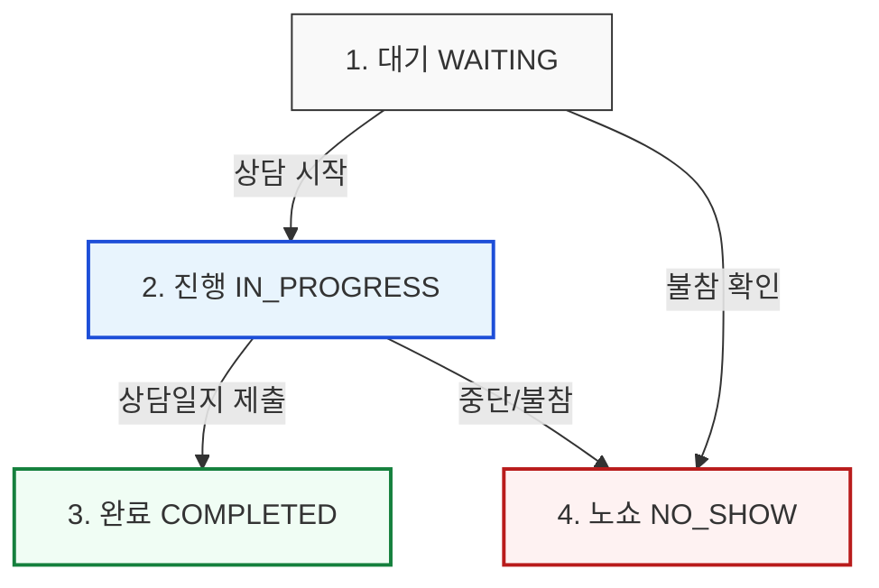

# 진행관리 및 증빙사진 기획 개선 아이데이션

본 문서는 실시간 진행 현황판(TimeGrid)의 사용성을 개선하고 현장 운영 효율성을 극대화하기 위해 출석 기능의 간소화, 노쇼(No-Show) 발생 시 대안, 그리고 증빙사진 등록 기능의 진행관리 통합 방안을 제안합니다.

---

## 구현 현황 (2026-06-30)

- **§1 출석 기능 제거 → 상태 버튼 통합: 구현 완료.**
  - 진행 대시보드 셀(`TimeGridSheet`)에서 전문가/스타트업 출석 마킹 컨트롤(`AttendanceSegmentedControl`)을 제거했다. 이제 대기/진행/완료/노쇼 상태 버튼이 단일 제어다.
  - 출석 호환성은 백엔드에서 자동 동기화(마이그레이션 `0062_status_drives_attendance.sql`): `admin_set_session_status` 가 진행/완료 전환 시 전문가·스타트업을 `PRESENT` 로, 대기 복귀 시 출석 로그 삭제(미정)로 처리한다. `mark_no_show` 는 스타트업을 `ABSENT`(불참)로 기록하고 전문가 출석은 보존한다. 만족도·통계가 참조하는 `attendance_logs` 호환성은 그대로 유지된다.
  - `ProgressDashboardPanel` 에서 더 이상 출석 폴링 쿼리/수동 출석 mutation 을 사용하지 않는다(상태 전환만 호출).
- **§3 증빙사진 셀 통합: 구현 완료.**
  - `TimeGridSheet` 각 셀 하단에 `📷` 버튼을 추가했다(등록 수 있으면 success 배지 `N장`, 없으면 점선 `사진 등록`). 클릭하면 `ProgressDashboardPanel` 의 모달이 열리고 기존 `CompanyPhotoUploadPanel` 을 그대로 재사용한다(촬영/미리보기/삭제/업로드). 사진은 (행사 × 스타트업 `company_user_id`) 단위라 한 스타트업의 모든 셀이 같은 묶음을 공유한다.
  - 상단 범례 영역에 "📷 사진 미등록 셀만 보기" 토글을 두었다. 켜면 사진 등록 완료 셀·빈 셀은 흐리게(`opacity-25`), 미등록 예약 셀은 `ring-warning` 으로 강조한다.
  - 백엔드 신규 없음: `useEventCompanyPhotos`/`company_photos` RLS(`is_admin_or_staff`) 를 그대로 사용한다(§4 권고대로 관리/스태프 권한).
- **§2 노쇼 대체 매칭: 구현 완료(슬롯 재사용형).**
  - 마이그레이션 `0063_replace_no_show.sql`: 신규 RPC `replace_no_show(p_slot_id, p_new_startup_id, p_reason)` 가 NO_SHOW 슬롯을 재사용해 현장 대기 스타트업을 새로 배정한다(WAITING 복귀, `booking_type='ADMIN_FORCE'`). 동시간/테이블 충돌은 `_validate_slot_assignment`(최대횟수만 우회)가 검증하고, 기존 노쇼 startup 의 출석 로그(ABSENT)는 정리한다. 노쇼 사실은 `mark_no_show` 가 이미 `booking_history`(NO_SHOW)+`audit_logs` 에 남겨 히스토리가 보존된다.
  - **문자 그대로의 안1(NO_SHOW 슬롯 보존 + 별도 대기 슬롯 복제)을 채택하지 않은 이유**: 그리드(`buildBookingSchedule`)는 (전문가×시작시각)당 비-CANCELLED 슬롯 1개만 그리고, `_validate_slot_assignment` 의 전문가/테이블 동시간 충돌 검사가 같은 칸의 NO_SHOW 슬롯을 점유로 보아 새 배정을 막는다. 안1 을 글자대로 하려면 그리드를 셀당 슬롯 배열로 재설계하고 검증에 NO_SHOW 예외를 둬야 해 범위·위험이 크다. 히스토리 보존이라는 안1 의 목적은 `booking_history` 가 이미 충족하므로 슬롯 재사용형으로 구현했다(트레이드오프: 대체 매칭 후 셀에 빨간 노쇼 배지는 남지 않고 감사 로그에만 남는다).
  - UI: `TimeGridSheet` 노쇼 셀에 "현장 대체 매칭" 버튼 → `ReplaceNoShowModal`(동시간 예약 있는 스타트업은 비활성, 사유 필수). 권한은 `can_staff_event`(현장 스태프+).
  - 부수 수정: `0062` 가 `mark_no_show` 권한을 `can_staff_event`(0043)에서 ADMIN 전용으로 좁힌 회귀를 `0063` 에서 복구.

### 후속 결정 메모

- (없음 — §1·§2·§3 구현 완료)

---

## 1. 출석 기능 제거 및 상태 버튼 대체 기획

### 기존 방식의 문제점
- **이중 관리 공수**: 셀 내에서 '전문가/스타트업 출석 여부(`- / V / X`)'를 마킹한 뒤, 아래에서 '세션 상태(`대기/진행/완료/노쇼`)'를 별도로 선택해야 하므로 운영자의 클릭 횟수가 과도하게 발생합니다.
- **UI 복잡성**: 150px 남짓한 작은 셀 내부에 다수의 버튼 and 세그먼티드 컨트롤이 밀집하여 모바일/태블릿 등 현장 기기에서 오동작을 유발하기 쉽습니다.

### 개선 제안: 상태 버튼으로 출석 통합
출석 여부를 상태 버튼 조작으로 완전히 일치시키고 기존의 출석 마킹 컨트롤을 화면에서 제거합니다.



#### 상태 버튼별 매핑 정의
1. **대기 (WAITING)**
   - **출석 상태**: 아직 미정 (대기중)
   - **의미**: 배정된 스타트업과 전문가가 매칭 테이블에 대기하고 있는 상태입니다.
2. **진행 (IN_PROGRESS)**
   - **출석 상태**: **[출석 완료]**로 자동 간주
   - **의미**: 상담이 시작되었으므로 두 참가자 모두 현장에 참석했음을 의미합니다.
3. **완료 (COMPLETED)**
   - **출석 상태**: **[출석 완료]**
   - **의미**: 상담이 정상 종료되고 결과가 기록된 상태입니다.
4. **노쇼 (NO_SHOW)**
   - **출석 상태**: **[불참]**으로 자동 간주
   - **의미**: 약속된 시간 내에 스타트업(혹은 전문가)이 현장에 나타나지 않은 상태입니다.

> [!NOTE]
> **백엔드/기존 통계 하위 호환성 유지 방안**
> 기존 데이터베이스 구조나 만족도 설문 조사 등에서 `attendance` 로그를 참조하고 있을 수 있습니다. 따라서 UI에서는 출석 버튼을 없애되, **상태 버튼이 클릭되는 시점(API 호출 시)**에 백엔드 또는 Hook 내부에서 해당 대상자들의 출석 로그(`PRESENT` 또는 `ABSENT`)를 자동으로 생성/갱신하는 트리거 로직을 구현하여 데이터 호환성을 유지합니다.

---

## 2. 노쇼(No-Show) 발생 시 대체 매칭(DB) 반영 방안

노쇼가 발생했을 때 해당 테이블과 전문가의 유휴 시간(약 50분 내외)을 활용하기 위해 현장 대기 스타트업을 대체 매칭하는 프로세스 아이디어입니다.

### 안 1. 노쇼 히스토리 보존형 '슬롯 분할 및 신규 매칭' (추천)
- **개념**: 통계 분석 및 패널티 부여를 위해 "누가 노쇼를 냈는지" 기록을 남겨두고, 해당 슬롯에 새로운 스타트업을 매칭합니다.
- **프로세스**:
  1. 관리자가 특정 셀을 **[노쇼]**로 지정합니다.
  2. 시스템은 기존 매칭 슬롯의 상태를 `NO_SHOW`로 잠금 처리하여 보존합니다.
  3. 동시에 동일 시간대/동일 테이블에 **새로운 대체 슬롯(대기 상태)**을 즉시 복제하여 생성합니다.
  4. 관리자는 새로 생긴 슬롯에 **[현장 매칭 등록]** 버튼을 통해 현장 대기 DB에 등록된 스타트업을 신규 배정합니다.
- **장점**: 기존 매칭의 노쇼 통계 데이터가 정확히 유지되며, 새로운 대체 매칭 히스토리도 별도로 남습니다.

### 안 2. 공석(Open Table) 전환 후 현장 즉석 배정
- **개념**: 노쇼가 나는 즉시 해당 테이블을 '오픈 테이블'로 변경하고, 스태프가 현장 대기 스타트업을 직접 매칭합니다.
- **프로세스**:
  1. 셀을 **[노쇼]** 처리하면 스타트업 영역이 `(현장 대체 대기 중)` 상태의 빈 슬롯과 유사하게 전환됩니다.
  2. 해당 셀을 클릭하면 **"현장 대기 스타트업 리스트"** 팝업이 노출됩니다.
  3. 현장에 도착해 대기 중인 기업들 중 순번에 맞는 기업을 클릭하여 대체 매칭을 완료합니다.
- **장점**: 슬롯을 새로 생성할 필요 없이 기존 슬롯의 참여 기업 데이터만 덮어써서 구조가 단순합니다. (단, 기존 노쇼 대상 기업의 통계 로그를 별도로 남겨두는 별도의 Audit Table이 필요할 수 있습니다.)

---

## 3. 진행관리 현황판 내 '증빙사진' 기능 통합 기획

기존의 별도 '증빙사진' 탭으로 이동할 필요 없이, 진행관리 화면에서 실시간으로 매칭 상태를 보며 즉시 사진을 업로드 및 검수하도록 통합합니다.

### UI/UX 개선안
각 셀(GridCell) 내부에 미니 카메라 아이콘(`📷`) 또는 사진 관리 인터페이스를 탑재합니다.

```
+-----------------------------------------+
| [A-01] 김민준 (전문가)                   |
| 09:00 ~ 09:40                           |
|-----------------------------------------|
| 넥스트에이아이 (스타트업)                 |
| [대기] [진행] [완료] [노쇼]             |
|                                         |
| 📷 증빙사진 (0장)  [업로드]             | <--- 신규 통합 영역
+-----------------------------------------+
```

#### 세부 기능
1. **사진 등록 상태 시각화**
   - **사진 없음**: 연한 회색 아이콘과 `사진 등록` 텍스트 (`📷 +`)
   - **사진 있음**: 브랜드 컬러 활성화 아이콘 및 업로드된 사진 수 표시 (`📷 2장`)
2. **원클릭 업로드 & 검수 팝오버**
   - 셀 내부의 `📷` 버튼 또는 `업로드` 텍스트를 클릭하면 미니 팝업 모달이 뜹니다.
   - 이 모달 내부에 기존 `CompanyPhotoUploadPanel`의 핵심 기능(카메라 촬영, 사진 미리보기, 사진 삭제, 올리기)을 그대로 컴팩트하게 탑재합니다.
3. **사진 일괄 조회 및 필터링 기능 (상단 툴바 추가)**
   - 타임그리드 상단 범례 영역 옆에 **[📷 사진 미등록 셀만 보기]** 필터 토글 스위치를 제공합니다.
   - 이 스위치를 켜면 사진 증빙이 누락된 미팅 슬롯(셀)들만 하이라이트되거나 필터링되어, 현장 스태프가 사진을 찍으러 돌아다녀야 할 테이블을 한눈에 확인할 수 있습니다.

---

## 4. 향후 구현 시 검토 사항

1. **역할 및 권한(Role)**
   - 전문가 화면에서도 사진을 넣을 수 있게 할 것인지, 아니면 관리자/스태프만 진행관리 화면에서 등록할 수 있게 할 것인지 정의가 필요합니다.
   - 일반적으로 스태프가 돌아다니며 촬영하므로, **스태프/관리자용 진행관리**에 우선 적용하는 것을 추천합니다.
2. **데이터 처리(노쇼)**
   - 노쇼 처리 시 사유를 필수로 입력받는 기존 팝업 모달(`onMarkNoShow`)은 그대로 유지하되, 상태값 전환이 직관적으로 이뤄지도록 플로우를 개선합니다.
