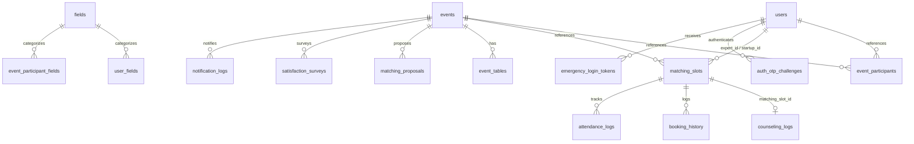

# 데이터베이스 설계 및 스키마 명세 (Database Schema Specification)

본 문서는 비즈니스 매칭 시스템의 백엔드와 데이터 저장을 책임지는 Supabase(PostgreSQL)의 데이터베이스 스키마, 테이블 구조, 제약 조건 및 데이터 정합성 규칙을 정의합니다.

---

## 1. 개요 및 설계 방향
- **백엔드 엔진**: Supabase (PostgreSQL 15+ 기반)
- **시간대 관리**: 모든 시작/종료 일시는 `TIMESTAMP WITH TIME ZONE`으로 절대 시점을 저장하고, 행사별 `timezone` 값(기본 `Asia/Seoul`)을 기준으로 화면에 변환 표시합니다.
- **고유 식별자**: 기본키(PK)는 분산 환경과 보안성 확보를 위해 UUID(`gen_random_uuid()`)를 사용합니다.
- **보안 및 소프트 삭제**: 
  - 참가자 로그인 OTP 원문은 저장하거나 로그에 남기지 않습니다. 단방향 해시와 만료·시도·사용 상태만 별도 챌린지 테이블에 저장합니다.
  - 탈퇴한 유저의 이메일을 동일하게 재등록할 수 있도록 `deleted_at IS NULL` 조건의 Partial Unique Index를 적용합니다.

---

## 2. 테이블 상세 정의



### 2.1 events (행사 테이블)
행사의 전반적인 기본 정보 및 예약/행사 기한을 저장합니다.
- `id` (UUID, PK): 행사의 고유 식별자.
- `title` (VARCHAR(255)): 행사 명칭.
- `status` (VARCHAR(50)): 현재 단계 (`DRAFT` | `BOOKING` | `ALLOCATION` | `PROGRESS` | `FINISHED` | `CANCELLED`).
- `status_override` (BOOLEAN): 수동 상태 고정 여부 (Cron 자동 전환 방지용).
- `status_override_reason` (TEXT, Nullable): 최고 관리자의 수동 상태 고정 사유.
- `status_overridden_by` (UUID, FK, Nullable): 수동 상태 고정 처리자.
- `status_overridden_at` (TIMESTAMPTZ, Nullable): 수동 상태 고정 시각.
- `booking_start` (TIMESTAMPTZ): 스타트업이 예약을 신청하기 시작하는 시간.
- `booking_end` (TIMESTAMPTZ): 스타트업 예약 마감 시간.
- `event_start` (TIMESTAMPTZ): 매칭 본 행사가 시작되는 시간.
- `event_end` (TIMESTAMPTZ): 매칭 행사가 완전히 공식 종료되는 시간.
- `max_sessions_per_startup` (INT): 스타트업당 예약할 수 있는 상담 세션 한도 수치 (기본값: 3).
- `allow_startup_self_booking` (BOOLEAN): 스타트업 자율 예약 허용 토글 (기본값: false). true이면 `ALLOCATION`·`PROGRESS` 단계에서도 스타트업이 본인 예약을 직접 변경·취소할 수 있습니다.
- `timezone` (VARCHAR(100)): 행사 기준 시간대 (기본값: 'Asia/Seoul').
- `created_at` (TIMESTAMPTZ): 행사 등록 일시.
- `deleted_at` (TIMESTAMPTZ, Nullable): 삭제(소프트 삭제) 처리 시각.

### 2.2 users (사용자 테이블)
참여 기업(스타트업), 전문가(자문단), 관리자 정보를 통합 관리합니다.
- `id` (UUID, PK): 사용자의 고유 식별자.
- `email` (VARCHAR(255)): 사용자 이메일.
- `name` (VARCHAR(100)): 실명.
- `role` (VARCHAR(50)): 권한 등급 (`ADMIN` | `STAFF` | `EXPERT` | `STARTUP`).
- `auth_user_id` (UUID, Nullable): Supabase Auth 사용자 ID. 관리자와 스태프 인증 연동에 사용.
- `access_code_hash` (TEXT, Nullable, Deprecated): 기존 Access Code 구현과의 전환 호환용. OTP 전환 마이그레이션 완료 후 제거합니다.
- `access_code_issued_at` (TIMESTAMPTZ, Nullable, Deprecated): 기존 코드 발급 시각. OTP 전환 마이그레이션 완료 후 제거합니다.
- `session_version` (INT): 관리자가 참가자의 기존 로그인 세션을 일괄 무효화하기 위한 버전 값.
- `phone_number` (VARCHAR(50)): 연락처 (알림톡 발송 대상).
- `company_name` (VARCHAR(255), Nullable): 스타트업 기업명 (역할이 스타트업일 경우 필수).
- `representative_name` (VARCHAR(100), Nullable): 스타트업 대표자명.
- `contact_name` (VARCHAR(100), Nullable): 스타트업 담당자명.
- `company_description` (TEXT, Nullable): 스타트업 한줄 소개/요약.
- `company_homepage` (VARCHAR(255), Nullable): 스타트업 홈페이지.
- `proposal_file_url` (VARCHAR(512), Nullable): 스타트업 사업소개서 PDF 스토리지 링크.
- `profile_image_url` (VARCHAR(512), Nullable): 전문가 프로필 사진 스토리지 링크.
- `expert_organization` (VARCHAR(255), Nullable): 전문가 소속 기관.
- `expert_position` (VARCHAR(100), Nullable): 전문가 직책.
- `expert_description` (TEXT, Nullable): 전문가 소개글.
- `is_super_admin` (BOOLEAN): 최고 관리자 권한 여부.
- `created_at` (TIMESTAMPTZ): 등록 일시.
- `deleted_at` (TIMESTAMPTZ, Nullable): 소프트 삭제 일시.

### 2.3 fields (분야 마스터 테이블)
시스템 전체에서 공유되는 표준 관심/전문 업종 분야 목록입니다.
- `id` (UUID, PK)
- `name` (VARCHAR(100), UNIQUE): 분야 명칭 (예: `바이오`, `인공지능`, `커머스`, `친환경`).

### 2.4 user_fields (사용자별 기본 분야 관계 테이블)
사용자가 가진 기본 관심/전문 분야 매핑 테이블입니다. (최대 3개 매칭 가능)
- `user_id` (UUID, FK): `users.id` 참조.
- `field_id` (UUID, FK): `fields.id` 참조.
- PRIMARY KEY `(user_id, field_id)`.

### 2.5 event_participant_fields (행사별 참가 분야 관계 테이블)
특정 행사에서 적용할 참가자의 관심/전문 분야입니다. 값이 없으면 `user_fields`를 상속합니다.
- `event_participant_id` (UUID, FK): `event_participants.id` 참조.
- `field_id` (UUID, FK): `fields.id` 참조.
- PRIMARY KEY `(event_participant_id, field_id)`.
- 사용자 기본 분야와 행사별 분야는 각각 최대 3개까지 허용하며 RPC 또는 Trigger에서 검증합니다.

### 2.6 event_participants (행사 참가 관계 테이블)
행사별 참가 유저 명단 정보 테이블입니다. (행사장 입장 및 기본 소속 테이블 매핑)
- `id` (UUID, PK)
- `event_id` (UUID, FK): `events.id` 참조 (Cascade Delete).
- `user_id` (UUID, FK): `users.id` 참조 (Cascade Delete).
- `participant_type` (VARCHAR(50)): 참가 역할 (`EXPERT` | `STARTUP`).
- `default_table_id` (UUID, FK, Nullable): `event_tables.id` 참조.
- CONSTRAINT `unique_event_participant` UNIQUE(`event_id`, `user_id`).

### 2.7 event_tables (행사장 테이블 정보)
행사장에 배치될 물리적 상담 테이블 목록입니다.
- `id` (UUID, PK)
- `event_id` (UUID, FK): `events.id` 참조 (Cascade Delete).
- `table_code` (VARCHAR(50)): 테이블 번호 또는 명칭 (예: `A-1`, `Table 10`).
- `description` (VARCHAR(255), Nullable): 층수, 구역 등의 장소 정보.
- `is_active` (BOOLEAN): 사용 가능 여부.
- CONSTRAINT `unique_event_table_code` UNIQUE(`event_id`, `table_code`).

### 2.8 matching_slots (매칭 시간표 슬롯 테이블)
전문가와 스타트업이 일대일 미팅을 수행하는 스케줄 예약 시간표 슬롯 단위입니다.
- `id` (UUID, PK)
- `event_id` (UUID, FK): `events.id` 참조.
- `expert_id` (UUID, FK): `users.id` 참조 (전문가).
- `startup_id` (UUID, FK, Nullable): `users.id` 참조 (예약 스타트업, 미예약 시 NULL).
- `start_time` (TIMESTAMPTZ): 세션 시작 시각.
- `end_time` (TIMESTAMPTZ): 세션 종료 시각.
- `table_id` (UUID, FK, Nullable): `event_tables.id` 참조 (NULL인 경우 `event_participants.default_table_id` 참조).
- `booking_type` (VARCHAR(50)): 예약 경로 (`NONE` | `MANUAL` | `AUTO_AI` | `ADMIN_FORCE`).
- `session_status` (VARCHAR(50)): 세션 진행 상태 (`WAITING` | `IN_PROGRESS` | `COMPLETED` | `NO_SHOW` | `CANCELLED`).
- `created_at` (TIMESTAMPTZ)

### 2.9 counseling_logs (상담일지 및 평가지 테이블)
전문가가 세션 종료 후 입력하는 5대 정량지표와 텍스트 피드백입니다. 점수는 관리자 전용이며, 텍스트는 `is_public = true`인 경우 행사 종료 후 스타트업에 공개할 수 있습니다.
- `id` (UUID, PK)
- `matching_slot_id` (UUID, FK, UNIQUE): `matching_slots.id` 참조 (1:1 관계).
- `score_technology` (INT): 기술성 평가 (1~5점).
- `score_expertise` (INT): 전문성 평가 (1~5점).
- `score_reliability` (INT): 신뢰도 평가 (1~5점).
- `score_collaboration` (INT): 협업 잠재력 평가 (1~5점).
- `score_probability` (INT): 거래/매칭 성사 가능성 평가 (1~5점).
- `content` (TEXT, Nullable): 텍스트 요약 피드백 코멘트. 최소 글자 수 제한이 없으며, 미입력 상태로 임시저장할 수 있습니다(최종 제출 전까지 작성).
- `follow_up_required` (BOOLEAN): 후속 연계 요청 여부.
- `follow_up_memo` (TEXT, Nullable): 후속 연계 메모.
- `is_public` (BOOLEAN): 스타트업 피드백 코멘트 공개 여부 (기본값: false).
- `submitted_at` (TIMESTAMPTZ): 제출 일시.
- `updated_at` (TIMESTAMPTZ, Nullable): 수정 일시.

### 2.10 booking_history (예약 거래 이력 테이블)
모든 예약 확정, 변경, 취소 트랜잭션을 분석 및 통계 목적으로 영구 기록하는 로그성 테이블입니다.
- `id` (UUID, PK)
- `matching_slot_id` (UUID, FK): `matching_slots.id` 참조.
- `action_type` (VARCHAR(50)): 액션 구분 (`CREATED` | `CHANGED` | `CANCELLED` | `NO_SHOW`).
- `actor_id` (UUID, FK): 행위를 가한 주체 (`users.id` 참조).
- `startup_id` (UUID, FK, Nullable): 당시 관련 스타트업 ID.
- `expert_id` (UUID, FK): 당시 관련 전문가 ID.
- `previous_slot_info` (JSONB, Nullable): 변경/취소 전 이전 스케줄 정보.
- `new_slot_info` (JSONB, Nullable): 생성/변경 후 스케줄 정보.
- `reason` (TEXT, Nullable): 취소 및 변경 사유.
- `created_at` (TIMESTAMPTZ): 로그 기록 시각.

### 2.11 attendance_logs (실시간 출석체크 로그 테이블)
참가자(스타트업 및 전문가)의 현장 체크인 이력을 개별 저장합니다.
- `id` (UUID, PK)
- `matching_slot_id` (UUID, FK): `matching_slots.id` 참조.
- `user_id` (UUID, FK): 출석 대상 사용자 ID.
- `role_type` (VARCHAR(50)): `EXPERT` | `STARTUP`
- `attendance_status` (VARCHAR(50)): `PRESENT` | `ABSENT`
- `check_in_type` (VARCHAR(50)): `QR` | `MANUAL`
- `checked_in_at` (TIMESTAMPTZ): 체크인 처리 시각.
- `checked_in_by` (UUID, FK): 체크인 처리자. 전문가 본인 체크인 또는 관리자/스태프의 스타트업 처리에 사용.
- `reason` (TEXT, Nullable): 오등록 수정 등의 수동 변경 시 변경 사유 필수 기록.

### 2.12 matching_proposals (AI 자동 배치 제안 테이블)
확정 전 자동 배치 결과를 실제 슬롯과 분리해 저장합니다.
- `id` (UUID, PK)
- `event_id` (UUID, FK): 대상 행사.
- `target_slot_id` (UUID, FK): 제안 대상 빈 슬롯.
- `startup_id` (UUID, FK, Nullable): 제안 스타트업. 미배치 결과 행은 NULL 가능.
- `score` (NUMERIC): 규칙 기반 적합도 점수.
- `field_matched` (BOOLEAN): 분야 일치 여부.
- `unmatched_reason` (VARCHAR(100), Nullable): 미배치 사유.
- `is_locked` (BOOLEAN): 관리자 수동 편집 잠금 여부.
- `created_at`, `updated_at` (TIMESTAMPTZ)

재계산 시 `is_locked = true`인 제안은 보존합니다. 최종 확정은 충돌이 발생한 제안 슬롯은 제외하고 정상 슬롯만 부분 확정하여 반영할 수 있으며, 충돌 사유와 대상은 요약 리포트로 관리자에게 명확히 표시합니다.

### 2.13 audit_logs (시스템 감사 로그 테이블)
관리자 강제 변경, 일정 상태 강제 번복 및 시스템 중요 운영 조작을 기록합니다.
- `id` (UUID, PK)
- `actor_id` (UUID, FK): `users.id` 참조 (조작 관리자).
- `action` (VARCHAR(255)): 조작 명칭.
- `target_type` (VARCHAR(100)): 대상 개체명 (예: `events`, `users`).
- `target_id` (UUID): 대상 개체의 PK.
- `old_values` (JSONB): 변경 전 상태 데이터.
- `new_values` (JSONB): 변경 후 상태 데이터.
- `reason` (TEXT): 조작 사유 (필수 입력).
- `created_at` (TIMESTAMPTZ): 로그 기록 시각.

### 2.14 satisfaction_surveys (행사 만족도 조사 결과 테이블)
행사 종료 시점에 참가 유저들이 작성하는 종합 설문지입니다.
- `id` (UUID, PK)
- `event_id` (UUID, FK): `events.id` 참조.
- `user_id` (UUID, FK): `users.id` 참조 (비익명 매핑).
- `rating_overall` (INT CHECK (rating_overall BETWEEN 1 AND 5)): 행사 전반 만족도.
- `rating_matching` (INT CHECK (rating_matching BETWEEN 1 AND 5)): 매칭 적절성 만족도.
- `rating_operation` (INT CHECK (rating_operation BETWEEN 1 AND 5)): 행사 운영 편의성 만족도.
- `rating_reparticipation` (INT CHECK (rating_reparticipation BETWEEN 1 AND 5)): 향후 재참여 의향 만족도.
- `comment` (TEXT, Nullable): 자유 개선 피드백 의견.
- `created_at` (TIMESTAMPTZ)
- CONSTRAINT UNIQUE(`event_id`, `user_id`): 행사당 1인 1회 제출.

### 2.15 notification_logs (알림 발송 추적 테이블)
이메일·카카오 알림톡·SMS의 발송 성공 및 재시도 상태를 추적합니다.
- `id` (UUID, PK)
- `idempotency_key` (VARCHAR(255), UNIQUE): 발송 중복 방지 키.
- `event_id` (UUID, FK): `events.id` 참조.
- `receiver_id` (UUID, FK): `users.id` 참조 (수신자).
- `notification_type` (VARCHAR(100)): 발송 이벤트종류.
- `channel` (VARCHAR(20)): `EMAIL` | `SMS` | `ALIMTALK`.
- `destination` (VARCHAR(255)): 이메일 주소 또는 수신 전화번호. 화면과 일반 로그에는 마스킹하여 표시합니다.
- `content` (TEXT): 알림 발송 본문.
- `status` (VARCHAR(50)): `PENDING` | `SENT` | `FAILED`.
- `retry_count` (INT): 재시도 횟수 (최대 3회).
- `next_retry_at` (TIMESTAMPTZ, Nullable): 지수 백오프에 따른 다음 재시도 시각.
- `error_message` (TEXT, Nullable): 솔루션 공급사의 오류 기록.
- `created_at`, `updated_at` (TIMESTAMPTZ)

### 2.16 auth_otp_challenges (참가자 OTP 챌린지 테이블)
참가자 로그인용 단기 OTP의 요청·검증 상태를 저장합니다. 브라우저에서는 직접 조회할 수 없고 서버 함수 또는 SECURITY DEFINER RPC만 접근합니다.
- `id` (UUID, PK)
- `user_id` (UUID, FK): 인증 대상 `users.id`.
- `purpose` (VARCHAR(50)): 현재는 `PARTICIPANT_LOGIN`.
- `channel` (VARCHAR(20)): `EMAIL` | `SMS` | `ALIMTALK`.
- `destination_normalized` (TEXT): 발송 대상의 정규화 값. 관리자 화면과 로그에는 마스킹하여 표시합니다.
- `otp_hash` (TEXT): salt가 포함된 단방향 해시. 원문은 저장하지 않습니다.
- `expires_at` (TIMESTAMPTZ): 기본 발급 시각부터 5분.
- `attempt_count` (INT): 검증 실패 횟수. 최대 5회.
- `used_at` (TIMESTAMPTZ, Nullable): 검증 성공 시각. 값이 있으면 재사용할 수 없습니다.
- `invalidated_at` (TIMESTAMPTZ, Nullable): 새 OTP 발급, 관리자 조치 등으로 무효화된 시각.
- `requested_ip_hash` (TEXT, Nullable): 레이트리밋·감사용 비식별 해시. 원 IP를 장기 저장하지 않습니다.
- `created_at` (TIMESTAMPTZ)

동일 사용자·목적의 새 OTP가 발급되면 이전 미사용 챌린지를 무효화합니다. 검증 성공과 `used_at` 기록은 하나의 트랜잭션에서 원자적으로 처리합니다.

### 2.17 emergency_login_tokens (현장 예외 로그인 토큰 테이블)
OTP 발송 장애 시 관리자가 본인 확인 후 발급하는 짧은 만료시간의 1회용 로그인 링크를 추적합니다.
- `id` (UUID, PK)
- `user_id` (UUID, FK): 로그인 대상 참가자.
- `token_hash` (TEXT): 원문을 저장하지 않는 단방향 해시.
- `issued_by` (UUID, FK): 발급 관리자.
- `reason` (TEXT): 본인 확인 방법과 발급 사유.
- `expires_at` (TIMESTAMPTZ): 짧은 만료시간 적용.
- `used_at` (TIMESTAMPTZ, Nullable)
- `revoked_at` (TIMESTAMPTZ, Nullable)
- `created_at` (TIMESTAMPTZ)

---

## 3. SQL DDL 스크립트

```sql
-- UUID 생성 및 비밀번호 해시 함수 사용
CREATE EXTENSION IF NOT EXISTS pgcrypto;

-- 1. 행사 테이블
CREATE TABLE events (
    id UUID PRIMARY KEY DEFAULT gen_random_uuid(),
    title VARCHAR(255) NOT NULL,
    status VARCHAR(50) NOT NULL DEFAULT 'DRAFT',
    status_override BOOLEAN NOT NULL DEFAULT FALSE,
    status_override_reason TEXT,
    status_overridden_at TIMESTAMP WITH TIME ZONE,
    booking_start TIMESTAMP WITH TIME ZONE NOT NULL,
    booking_end TIMESTAMP WITH TIME ZONE NOT NULL,
    event_start TIMESTAMP WITH TIME ZONE NOT NULL,
    event_end TIMESTAMP WITH TIME ZONE NOT NULL,
    max_sessions_per_startup INT NOT NULL DEFAULT 3,
    allow_startup_self_booking BOOLEAN NOT NULL DEFAULT FALSE,
    timezone VARCHAR(100) NOT NULL DEFAULT 'Asia/Seoul',
    created_at TIMESTAMP WITH TIME ZONE DEFAULT CURRENT_TIMESTAMP,
    deleted_at TIMESTAMP WITH TIME ZONE,
    CONSTRAINT chk_events_status CHECK (status IN ('DRAFT', 'BOOKING', 'ALLOCATION', 'PROGRESS', 'FINISHED', 'CANCELLED')),
    CONSTRAINT chk_booking_dates CHECK (booking_start < booking_end),
    CONSTRAINT chk_event_dates CHECK (event_start < event_end),
    CONSTRAINT chk_booking_limit CHECK (booking_end <= event_start),
    CONSTRAINT chk_max_sessions CHECK (max_sessions_per_startup > 0)
);

-- 2. 사용자 테이블
CREATE TABLE users (
    id UUID PRIMARY KEY DEFAULT gen_random_uuid(),
    email VARCHAR(255) NOT NULL,
    name VARCHAR(100) NOT NULL,
    role VARCHAR(50) NOT NULL DEFAULT 'STARTUP',
    auth_user_id UUID UNIQUE,
    access_code_hash TEXT,
    access_code_issued_at TIMESTAMP WITH TIME ZONE,
    session_version INT NOT NULL DEFAULT 1,
    phone_number VARCHAR(50),
    company_name VARCHAR(255),
    representative_name VARCHAR(100),
    contact_name VARCHAR(100),
    company_description TEXT,
    company_homepage VARCHAR(255),
    proposal_file_url VARCHAR(512),
    profile_image_url VARCHAR(512),
    expert_organization VARCHAR(255),
    expert_position VARCHAR(100),
    expert_description TEXT,
    is_super_admin BOOLEAN NOT NULL DEFAULT FALSE,
    created_at TIMESTAMP WITH TIME ZONE DEFAULT CURRENT_TIMESTAMP,
    deleted_at TIMESTAMP WITH TIME ZONE,
    CONSTRAINT chk_users_role CHECK (role IN ('ADMIN', 'STAFF', 'EXPERT', 'STARTUP'))
);

ALTER TABLE events
    ADD COLUMN status_overridden_by UUID REFERENCES users(id) ON DELETE SET NULL;

-- 소프트 삭제 고려 이메일 부분 유니크 인덱스 생성
CREATE UNIQUE INDEX users_active_email_idx ON users (email) WHERE deleted_at IS NULL;

-- 3. 분야 마스터 테이블
CREATE TABLE fields (
    id UUID PRIMARY KEY DEFAULT gen_random_uuid(),
    name VARCHAR(100) UNIQUE NOT NULL
);

-- 4. 사용자별 기본 분야 테이블
CREATE TABLE user_fields (
    user_id UUID REFERENCES users(id) ON DELETE CASCADE,
    field_id UUID REFERENCES fields(id) ON DELETE CASCADE,
    PRIMARY KEY (user_id, field_id)
);

-- 5. 행사 테이블 마스터
CREATE TABLE event_tables (
    id UUID PRIMARY KEY DEFAULT gen_random_uuid(),
    event_id UUID REFERENCES events(id) ON DELETE CASCADE,
    table_code VARCHAR(50) NOT NULL,
    description VARCHAR(255),
    is_active BOOLEAN NOT NULL DEFAULT TRUE,
    CONSTRAINT unique_event_table_code UNIQUE(event_id, table_code)
);

-- 6. 행사 참가 관계 테이블
CREATE TABLE event_participants (
    id UUID PRIMARY KEY DEFAULT gen_random_uuid(),
    event_id UUID REFERENCES events(id) ON DELETE CASCADE,
    user_id UUID REFERENCES users(id) ON DELETE CASCADE,
    participant_type VARCHAR(50) NOT NULL,
    default_table_id UUID REFERENCES event_tables(id) ON DELETE SET NULL,
    CONSTRAINT unique_event_participant UNIQUE(event_id, user_id),
    CONSTRAINT chk_participant_type CHECK (participant_type IN ('EXPERT', 'STARTUP'))
);

-- 7. 행사별 참가 분야 테이블
CREATE TABLE event_participant_fields (
    event_participant_id UUID REFERENCES event_participants(id) ON DELETE CASCADE,
    field_id UUID REFERENCES fields(id) ON DELETE CASCADE,
    PRIMARY KEY (event_participant_id, field_id)
);

-- 8. 매칭 슬롯 테이블
CREATE TABLE matching_slots (
    id UUID PRIMARY KEY DEFAULT gen_random_uuid(),
    event_id UUID REFERENCES events(id) ON DELETE CASCADE,
    expert_id UUID REFERENCES users(id) ON DELETE CASCADE,
    startup_id UUID REFERENCES users(id) ON DELETE SET NULL,
    start_time TIMESTAMP WITH TIME ZONE NOT NULL,
    end_time TIMESTAMP WITH TIME ZONE NOT NULL,
    table_id UUID REFERENCES event_tables(id) ON DELETE SET NULL,
    booking_type VARCHAR(50) NOT NULL DEFAULT 'NONE',
    session_status VARCHAR(50) NOT NULL DEFAULT 'WAITING',
    created_at TIMESTAMP WITH TIME ZONE DEFAULT CURRENT_TIMESTAMP,
    CONSTRAINT chk_slot_dates CHECK (start_time < end_time),
    CONSTRAINT chk_booking_type CHECK (booking_type IN ('NONE', 'MANUAL', 'AUTO_AI', 'ADMIN_FORCE')),
    CONSTRAINT chk_session_status CHECK (session_status IN ('WAITING', 'IN_PROGRESS', 'COMPLETED', 'NO_SHOW', 'CANCELLED'))
);

-- 9. 상담일지 및 평가지 테이블
CREATE TABLE counseling_logs (
    id UUID PRIMARY KEY DEFAULT gen_random_uuid(),
    matching_slot_id UUID UNIQUE REFERENCES matching_slots(id) ON DELETE CASCADE,
    score_technology INT CHECK (score_technology BETWEEN 1 AND 5),
    score_expertise INT CHECK (score_expertise BETWEEN 1 AND 5),
    score_reliability INT CHECK (score_reliability BETWEEN 1 AND 5),
    score_collaboration INT CHECK (score_collaboration BETWEEN 1 AND 5),
    score_probability INT CHECK (score_probability BETWEEN 1 AND 5),
    content TEXT,
    follow_up_required BOOLEAN NOT NULL DEFAULT FALSE,
    follow_up_memo TEXT,
    is_public BOOLEAN NOT NULL DEFAULT FALSE,
    submitted_at TIMESTAMP WITH TIME ZONE DEFAULT CURRENT_TIMESTAMP,
    updated_at TIMESTAMP WITH TIME ZONE
    -- 코멘트 최소 글자 수 제한 없음(임시저장 허용). 최종 제출 검증은 RPC에서 처리.
);

-- 10. 예약 거래 이력 테이블
CREATE TABLE booking_history (
    id UUID PRIMARY KEY DEFAULT gen_random_uuid(),
    matching_slot_id UUID REFERENCES matching_slots(id) ON DELETE SET NULL,
    action_type VARCHAR(50) NOT NULL,
    actor_id UUID REFERENCES users(id) ON DELETE SET NULL,
    startup_id UUID REFERENCES users(id) ON DELETE SET NULL,
    expert_id UUID REFERENCES users(id) ON DELETE SET NULL,
    previous_slot_info JSONB,
    new_slot_info JSONB,
    reason TEXT,
    created_at TIMESTAMP WITH TIME ZONE DEFAULT CURRENT_TIMESTAMP,
    CONSTRAINT chk_action_type CHECK (action_type IN ('CREATED', 'CHANGED', 'CANCELLED', 'NO_SHOW'))
);

-- 11. 실시간 출석체크 로그 테이블
CREATE TABLE attendance_logs (
    id UUID PRIMARY KEY DEFAULT gen_random_uuid(),
    matching_slot_id UUID REFERENCES matching_slots(id) ON DELETE CASCADE,
    user_id UUID REFERENCES users(id) ON DELETE CASCADE,
    role_type VARCHAR(50) NOT NULL,
    attendance_status VARCHAR(50) NOT NULL,
    check_in_type VARCHAR(50) NOT NULL,
    checked_in_at TIMESTAMP WITH TIME ZONE DEFAULT CURRENT_TIMESTAMP,
    checked_in_by UUID REFERENCES users(id) ON DELETE SET NULL,
    reason TEXT,
    CONSTRAINT chk_role_type CHECK (role_type IN ('EXPERT', 'STARTUP')),
    CONSTRAINT chk_attendance_status CHECK (attendance_status IN ('PRESENT', 'ABSENT')),
    CONSTRAINT chk_check_in_type CHECK (check_in_type IN ('QR', 'MANUAL'))
);

-- 12. AI 자동 배치 제안 테이블
CREATE TABLE matching_proposals (
    id UUID PRIMARY KEY DEFAULT gen_random_uuid(),
    event_id UUID REFERENCES events(id) ON DELETE CASCADE,
    target_slot_id UUID REFERENCES matching_slots(id) ON DELETE CASCADE,
    startup_id UUID REFERENCES users(id) ON DELETE CASCADE,
    score NUMERIC(6,2) NOT NULL DEFAULT 0,
    field_matched BOOLEAN NOT NULL DEFAULT FALSE,
    unmatched_reason VARCHAR(100),
    is_locked BOOLEAN NOT NULL DEFAULT FALSE,
    created_at TIMESTAMP WITH TIME ZONE DEFAULT CURRENT_TIMESTAMP,
    updated_at TIMESTAMP WITH TIME ZONE,
    CONSTRAINT unique_proposal_slot UNIQUE(event_id, target_slot_id)
);

-- 13. 시스템 감사 로그 테이블
CREATE TABLE audit_logs (
    id UUID PRIMARY KEY DEFAULT gen_random_uuid(),
    actor_id UUID REFERENCES users(id) ON DELETE SET NULL,
    action VARCHAR(255) NOT NULL,
    target_type VARCHAR(100) NOT NULL,
    target_id UUID NOT NULL,
    old_values JSONB,
    new_values JSONB,
    reason TEXT NOT NULL,
    created_at TIMESTAMP WITH TIME ZONE DEFAULT CURRENT_TIMESTAMP
);

-- 14. 행사 만족도 조사 결과 테이블
CREATE TABLE satisfaction_surveys (
    id UUID PRIMARY KEY DEFAULT gen_random_uuid(),
    event_id UUID REFERENCES events(id) ON DELETE CASCADE,
    user_id UUID REFERENCES users(id) ON DELETE CASCADE,
    rating_overall INT CHECK (rating_overall BETWEEN 1 AND 5),
    rating_matching INT CHECK (rating_matching BETWEEN 1 AND 5),
    rating_operation INT CHECK (rating_operation BETWEEN 1 AND 5),
    rating_reparticipation INT CHECK (rating_reparticipation BETWEEN 1 AND 5),
    comment TEXT,
    created_at TIMESTAMP WITH TIME ZONE DEFAULT CURRENT_TIMESTAMP,
    CONSTRAINT unique_event_survey_response UNIQUE(event_id, user_id)
);

-- 15. 알림 발송 추적 테이블
CREATE TABLE notification_logs (
    id UUID PRIMARY KEY DEFAULT gen_random_uuid(),
    idempotency_key VARCHAR(255) UNIQUE NOT NULL,
    event_id UUID REFERENCES events(id) ON DELETE CASCADE,
    receiver_id UUID REFERENCES users(id) ON DELETE CASCADE,
    notification_type VARCHAR(100) NOT NULL,
    channel VARCHAR(20) NOT NULL,
    destination VARCHAR(255) NOT NULL,
    content TEXT NOT NULL,
    status VARCHAR(50) NOT NULL DEFAULT 'PENDING',
    retry_count INT NOT NULL DEFAULT 0,
    next_retry_at TIMESTAMP WITH TIME ZONE,
    error_message TEXT,
    created_at TIMESTAMP WITH TIME ZONE DEFAULT CURRENT_TIMESTAMP,
    updated_at TIMESTAMP WITH TIME ZONE,
    CONSTRAINT chk_notif_channel CHECK (channel IN ('EMAIL', 'SMS', 'ALIMTALK')),
    CONSTRAINT chk_notif_status CHECK (status IN ('PENDING', 'SENT', 'FAILED')),
    CONSTRAINT chk_notif_retry_count CHECK (retry_count BETWEEN 0 AND 3)
);

-- 16. 참가자 로그인 OTP 챌린지
CREATE TABLE auth_otp_challenges (
    id UUID PRIMARY KEY DEFAULT gen_random_uuid(),
    user_id UUID NOT NULL REFERENCES users(id) ON DELETE CASCADE,
    purpose VARCHAR(50) NOT NULL DEFAULT 'PARTICIPANT_LOGIN',
    channel VARCHAR(20) NOT NULL,
    destination_normalized TEXT NOT NULL,
    otp_hash TEXT NOT NULL,
    expires_at TIMESTAMP WITH TIME ZONE NOT NULL,
    attempt_count INT NOT NULL DEFAULT 0,
    used_at TIMESTAMP WITH TIME ZONE,
    invalidated_at TIMESTAMP WITH TIME ZONE,
    requested_ip_hash TEXT,
    created_at TIMESTAMP WITH TIME ZONE DEFAULT CURRENT_TIMESTAMP,
    CONSTRAINT chk_otp_purpose CHECK (purpose IN ('PARTICIPANT_LOGIN')),
    CONSTRAINT chk_otp_channel CHECK (channel IN ('EMAIL', 'SMS', 'ALIMTALK')),
    CONSTRAINT chk_otp_attempt_count CHECK (attempt_count BETWEEN 0 AND 5)
);

CREATE INDEX auth_otp_active_lookup_idx
    ON auth_otp_challenges (user_id, purpose, created_at DESC)
    WHERE used_at IS NULL AND invalidated_at IS NULL;

-- 17. 현장 예외용 1회 로그인 토큰
CREATE TABLE emergency_login_tokens (
    id UUID PRIMARY KEY DEFAULT gen_random_uuid(),
    user_id UUID NOT NULL REFERENCES users(id) ON DELETE CASCADE,
    token_hash TEXT NOT NULL,
    issued_by UUID NOT NULL REFERENCES users(id) ON DELETE RESTRICT,
    reason TEXT NOT NULL,
    expires_at TIMESTAMP WITH TIME ZONE NOT NULL,
    used_at TIMESTAMP WITH TIME ZONE,
    revoked_at TIMESTAMP WITH TIME ZONE,
    created_at TIMESTAMP WITH TIME ZONE DEFAULT CURRENT_TIMESTAMP
);
```

---

## 4. 데이터 정합성 보장 규칙

### 4.1 스케줄 겹침 방지 (Overlapping Constraint)
- **제약**: 특정 스타트업 또는 특정 전문가는 동일한 시간 범위에 여러 예약을 등록할 수 없습니다.
- **예약 신청 API 수준 유효성 검사 절차**:
  1. 신규 예약을 하려는 `startup_id`와 `start_time` 및 `end_time`을 전달받음.
  2. 다음 SQL 조건이 만족하는 기존 예약이 존재할 경우 에러 반환:
     ```sql
     SELECT 1 FROM matching_slots
     WHERE (startup_id = :startup_id OR expert_id = :expert_id)
       AND (start_time < :end_time AND end_time > :start_time);
     ```

### 4.2 테이블 중복 매칭 방지 (Table Conflict Prevention)
- **제약**: 슬롯의 `table_id`가 있으면 이를 사용하고, NULL이면 전문가의 `event_participants.default_table_id`를 적용한 **실제 사용 테이블**을 기준으로 중복을 차단합니다.
- 단순 쿼리 예시는 아래와 같으며 실제 예약 RPC에서는 기본 테이블까지 해석하여 검사합니다.
  ```sql
  SELECT 1 FROM matching_slots
  WHERE event_id = :event_id
    AND table_id = :table_id
    AND (start_time < :end_time AND end_time > :start_time);
  ```

### 4.3 예약 및 변경 트랜잭션
- 예약 신청, 변경, 취소, 관리자 강제 배정은 클라이언트의 직접 `UPDATE`가 아니라 권한이 검증된 DB RPC로만 처리합니다.
- RPC는 슬롯 점유 여부, 행사 상태, 참가 등록 여부, 동시간 중복, 동일 전문가 중복 예약, 최대 상담 횟수 및 테이블 충돌을 한 트랜잭션에서 검증합니다.
- 관리자 강제 배정은 최대 상담 횟수만 우회할 수 있으며 동시간 중복과 테이블 충돌은 우회할 수 없습니다.
- 스타트업 본인 예약(신청·변경·취소)은 기본적으로 `BOOKING` 단계에서만 허용합니다. 단 `events.allow_startup_self_booking = true`이면 `ALLOCATION`·`PROGRESS` 단계에서도 스타트업 본인 변경·취소를 허용합니다.
- 예약 변경 실패 시 기존 예약을 유지합니다. 별도의 임시 Hold 상태는 사용하지 않습니다.
- 변경과 취소 결과는 `booking_history`에, 관리자 중요 조작은 `audit_logs`에도 기록합니다.

### 4.4 행사 및 세션 상태 전이
- 행사 상태는 `DRAFT → BOOKING → ALLOCATION → PROGRESS → FINISHED` 순서이며 취소 시 `CANCELLED`로 전환합니다.
- Supabase Cron이 1분마다 일정 정보를 확인해 상태를 갱신합니다.
- `status_override = true`이면 Cron은 상태를 변경하지 않습니다. 직접 변경은 최고 관리자만 가능하며 처리자, 시각, 사유를 기록합니다.
- 완료된 상담일지가 하나라도 존재하면 행사를 `DRAFT` 또는 `BOOKING`으로 되돌릴 수 없습니다.
- 세션 상태는 다음 전이만 허용합니다.
  - `WAITING → IN_PROGRESS → COMPLETED`
  - `WAITING | IN_PROGRESS → NO_SHOW`
  - `WAITING → CANCELLED`
- `IN_PROGRESS`는 전문가가 `상담 시작`을 명시적으로 실행할 때 저장합니다.
- `COMPLETED` 전환과 상담일지 제출은 하나의 RPC 트랜잭션으로 처리합니다.

### 4.5 출석 상태 판정
- 출석은 행사 최초 1회가 아니라 상담 슬롯마다 기록합니다.
- `attendance_logs`에서 슬롯과 사용자별 가장 최근 레코드를 현재 출석 상태로 간주합니다.
- 전문가는 본인 출석만 처리할 수 있고, 스타트업 출석은 관리자 또는 `STAFF`가 처리합니다.
- QR은 사용자 UUID를 직접 포함하지 않는 30초 만료 서명 토큰을 사용합니다. QR 검증 실패 시 관리자 또는 스태프가 이름·기업명 검색으로 수동 처리할 수 있습니다.

### 4.6 자동 배치 확정
- 자동 배치는 동일 입력에 같은 결과가 나오도록 랜덤 요소 없이 수행합니다.
- 가용 슬롯과 제약 조건이 허용하는 범위에서 0회 배정 스타트업을 우선합니다.
- 분야가 일치하지 않더라도 잔여 슬롯이 있으면 차선 배치를 제안할 수 있으며 `field_matched = false` 경고를 표시합니다.
- 미배치 결과에는 사유를 저장합니다. 관리자 잠금 제안은 재계산으로 덮어쓰지 않습니다.
- 최종 확정은 충돌 슬롯만 제외하고 정상 슬롯을 부분 확정하여 실제 `matching_slots`에 반영하며, 제외된 충돌 건은 사유·대상을 요약 리포트로 표시합니다.

### 4.7 참가자 OTP 및 소프트 삭제
- OTP 원문은 발송 과정에서만 사용하고 저장하거나 로그에 남기지 않습니다.
- OTP는 기본 5분 후 만료되며, 새 OTP 발급 시 기존 미사용 OTP를 무효화합니다.
- 챌린지당 최대 5회 실패 후 더 이상 검증할 수 없고 새 OTP를 요청해야 합니다.
- OTP 검증 성공과 사용 처리는 한 트랜잭션에서 수행해 동시 재사용을 차단합니다.
- 관리자 세션 무효화 시 `session_version`을 증가시켜 기존 참가자 JWT를 무효화합니다.
- 관리자와 스태프는 Supabase Auth를 사용하며 참가자 OTP 인증과 분리합니다.
- 기존 `access_code_hash`와 `access_code_issued_at`은 전환 마이그레이션 동안만 유지하는 Deprecated 컬럼입니다.
- 소프트 삭제된 사용자와 같은 이메일은 신규 계정으로 다시 등록할 수 있습니다.
