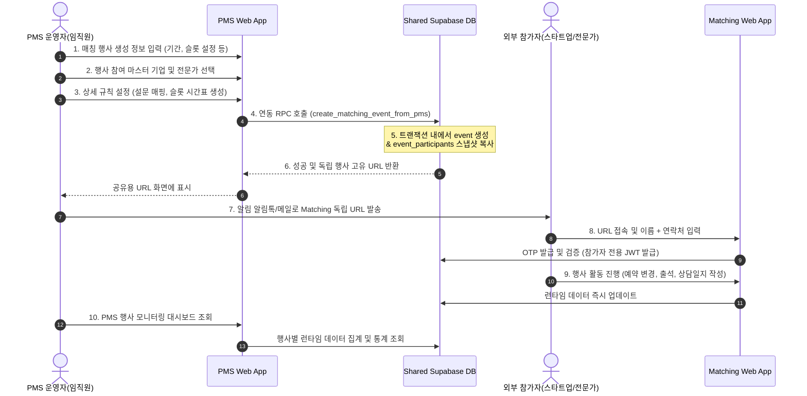

# PMS - Matching 시스템 통합 및 연동 전략 (Integration Strategy)

본 문서는 사내에서 운영하는 두 개의 React 기반 웹 서비스인 **PMS(Project Management System)**와 **Matching(비즈니스 매칭 행사 운영 플랫폼)**의 효율적인 연동 및 데이터 아키텍처 통합 방향을 정의한 아키텍처 의사결정 문서(ADR)입니다.

---

## 1. 개요 및 배경

현재 당사는 역할과 타겟 디바이스가 서로 다른 두 개의 React 기반 프론트엔드 웹 서비스를 운영하고 있습니다.

### 1.1 PMS (Project Management System)
* **목적**: 내부 임직원이 기업, 전문가, 프로젝트, 사업, 내부 담당자, 행사 정보를 종합적으로 관리하는 백오피스 및 Master DB 역할
* **특징**: PC 브라우저 최적화, React Vite SPA, Ant Design, Tailwind CSS v3, Supabase 연동
* **역할**: 기업 및 전문가의 마스터 원본 정보 저장소

### 1.2 Matching (비즈니스 매칭 플랫폼)
* **목적**: 외부 스타트업 및 전문가가 행사 현장에서 사용하는 예약/스케줄/출석/상담일지 작성 모바일 최적화 웹앱
* **특징**: 모바일 브라우저 최적화, React Vite SPA, Tailwind CSS v4/Custom CSS, Supabase 연동, 독자적인 도메인에서 기동
* **역할**: 행사 런타임(예약 신청, 현장 출석체크, 사진 업로드, 상담일지 피드백, 만족도 설문 등) 수행

### 1.3 핵심 요구사항
내부 사용자가 PMS에서 기업, 전문가, 프로젝트를 관리하다가 필요 시 **"비즈니스 매칭 행사"**를 생성하고 세팅할 수 있어야 합니다. PMS에서 세팅이 완료되면 외부 참가자(스타트업, 전문가)용 **독립 접속 URL**이 발급되며, 참가자는 PMS 계정 없이 Matching 도메인 상에서 행사 정보 조회 및 예약 서비스를 이용합니다.

---

## 2. 아키텍처 의사결정 (Architecture Decision)

### 결정 1. PMS와 Matching 프론트엔드는 완전히 분리 유지한다
> **이유**:
> * **타겟 사용자층과 사용 환경의 상이함**: PMS는 사내 임직원용 오피스 툴(PC 중심)인 반면, Matching은 행사 당일 현장에서 모바일로 접속하는 불특정 다수의 스타트업 및 전문가가 대상입니다.
> * **기술 스택 및 스타일 시트의 차이**: PMS는 Ant Design 기반의 어드민 템플릿(Tailwind v3)을 사용하고 있으나, Matching은 모바일 웹 환경의 기민함과 독창적 디자인 구현을 위해 Tailwind v4 및 Custom CSS 기반으로 설계되어 있습니다. 이 두 소스코드를 합칠 경우 CSS 충돌 및 패키지 무거워짐 현상이 발생할 수 있습니다.
> * **배포 및 도메인 분리**: 외부 사용자가 사내 어드민 페이지(PMS)가 기동 중인 웹 서버에 직접 접근하게 하는 것은 보안 및 트래픽 격리 측면에서 바람직하지 않습니다.

### 결정 2. 데이터베이스는 단일 Supabase Instance(PostgreSQL)를 기반으로 통합/운영한다
> **이유**:
> * 실시간으로 관리되는 PMS의 기업 및 전문가 정보가 Matching 행사 참가자로 신속하게 등록되어야 합니다.
> * 별개의 데이터베이스로 분리할 경우 CDC(Change Data Capture)나 API 기반의 무거운 데이터 동기화 파이프라인을 구축해야 하므로 관리 오버헤드가 급증합니다.
> * Supabase의 **Row Level Security(RLS)** 및 **PostgreSQL Schema/Schema-based RLS**를 적용하면 단일 데이터베이스 내에서도 확실하게 내부 어드민 데이터와 외부 참가자용 런타임 데이터를 물리적/논리적으로 격리할 수 있습니다.

### 결정 3. DB 내부에서도 PMS 영역(Master)과 Matching 영역(Runtime)의 경계를 엄격히 획정한다
> **이유**:
> * PMS는 장기 보존되고 변경 주기가 긴 **마스터 데이터(Master Data)** 역할을 수행합니다.
> * Matching은 특정 시점에 열리고 종료되는 행사 주기성 **런타임 데이터(Event Runtime Data)**를 관리합니다.
> * Matching 영역은 철저히 PMS에서 "행사가 발급"된 이후에만 읽고 쓸 수 있는 하위 엔티티 구조를 가집니다.

---

## 3. 권장 아키텍처 (System Architecture)

```mermaid
flowchart TD
    subgraph PMS_Domain [PMS 영역 (내부망/PC)]
        PMS_FE[PMS Frontend<br/>React + AntD + Tailwind v3]
    end

    subgraph Matching_Domain [Matching 영역 (외부망/모바일)]
        Matching_FE[Matching Frontend<br/>React + Tailwind v4 + Custom CSS]
    end

    subgraph Supabase_DB [통합 Supabase Instance]
        subgraph Master_Data_Tables [PMS Master Data Schema/Tables]
            Users_Table[(users)]
            Fields_Table[(fields)]
            User_Fields_Table[(user_fields)]
            Projects_Table[(projects)]
        end
        
        subgraph Security_Gate [보안 및 연동 인터페이스]
            RLS[Row Level Security 정책]
            RPCs[RPC / Edge Functions<br/>ex: create_matching_event_from_pms]
        end

        subgraph Runtime_Data_Tables [Matching Runtime Tables]
            Events_Table[(events)]
            Participants_Table[(event_participants)]
            Slots_Table[(matching_slots)]
            Logs_Table[(counseling_logs)]
            Photos_Table[(company_photos)]
            Proposal_Table[(proposal_uploads)]
            Logs_History[(booking_history)]
            Attendance_Table[(attendance_logs)]
        end
    end

    %% 연결 관계
    PMS_FE -->|관리자 로그인 / anon key| RPCs
    Matching_FE -->|참가자 JWT 로그인 / anon key| Runtime_Data_Tables
    
    RPCs -->|Master Data 참조| Master_Data_Tables
    RPCs -->|트랜잭션 단위 복사 및 발급| Runtime_Data_Tables

    %% RLS 제어
    RLS -.->|임직원 접근 허용| Master_Data_Tables
    RLS -.->|외부 참가자 접근 제한| Master_Data_Tables
    RLS -.->|행사별 접근 통제| Runtime_Data_Tables
```

### 3.1 컴포넌트별 역할 정의
1. **PMS Frontend**: 내부 임직원이 로그인하여 기업/전문가 마스터를 조회하고, 행사 기획 단계에서 참가 대상 기업 및 전문가를 선정하여 매칭 행사를 발급/관리합니다.
2. **Matching Frontend**: 발급된 독립 URL(`https://matching.domain.com/events/[event_id]`)을 통해 외부 참가자가 접근하며, 오직 이 도메인 내에서만 이름과 연락처 기반으로 로그인하여 실시간 런타임 데이터(예약 변경, 출석, 설문 등)를 입력하고 확인합니다.
3. **Shared Supabase DB**: 두 개의 프론트엔드가 공동으로 연결되는 단일 데이터 저장소입니다. 동일한 데이터베이스 내에서 스키마 혹은 RLS로 영역을 나누어 통제합니다.

---

## 4. 데이터 책임 및 스키마 분리 (Data Ownership)

두 시스템이 상호의 영역을 부적절하게 침범하지 않도록, 테이블 구조상에서 쓰기(CUD)와 읽기(R)의 주체를 확실히 정의합니다.

### 4.1 데이터 분류 및 오너십 매핑

| 구분 | 테이블/엔티티 목록 | 주 소유주 (Owner) | 데이터 관리 성격 |
| :--- | :--- | :--- | :--- |
| **PMS Master** | `users` (ADMIN/STAFF), `fields`, `user_fields`, 프로젝트/사업 정보, 매칭 행사 기본 설정, 권한 맵 | **PMS** | 시스템 마스터 데이터 (읽기/쓰기 PMS 독점) |
| **Matching Runtime** | `events`, `event_participants`, `event_operator_roles`, `matching_slots`, `booking_history`, `attendance_logs`, `counseling_logs`, `satisfaction_surveys`, `company_photos`, `proposal_uploads`, `notification_logs` | **Matching** | 런타임 데이터 (행사 중 참가자/운영자 상호작용 기록) |

### 4.2 스냅샷 데이터 생성 및 보존 원칙 (Snapshotting)
> [!IMPORTANT]
> **원본 데이터의 정합성 격리 원칙**
> * 기업(스타트업) 및 전문가의 원본 정보(`대표명`, `기업명`, `연락처`, `소속 기관` 등)는 PMS Master 영역에서 영구히 관리됩니다.
> * 그러나 특정 행사는 **진행 시점(Runtime)**의 참가자 정보가 영구 보존되어야 합니다. 행사 도중 혹은 종료 후에 PMS에서 원본 기업명이나 연락처를 변경하더라도, 기 진행되었던 과거 행사 데이터(예약 내역, 참석 로그, 상담 일지)의 결합 정합성이 깨져서는 안 됩니다.
> * **해결 책**:
>   1. `event_participants` 테이블 내에 행사 시점의 **스냅샷 필드**(예: `display_company_name`, `display_phone_number`, `display_expert_organization` 등)를 두고, 행사 생성 및 참가자 배치 시점에 PMS의 정보를 복사하여 기록합니다.
>   2. 외부 참가자가 로그인하거나 행사 화면에 표시되는 참가자 정보는 원본 `users` 테이블을 매번 Join하여 가져오지 않고, `event_participants` 내의 스냅샷 데이터를 바라보게 유도합니다.

---

## 5. 연동 프로세스 흐름 (Integration Flow)

PMS에서 행사가 생성되어 외부 참가자가 완료하기까지의 전체 앤드투앤드(End-to-End) 흐름은 다음과 같습니다.



### 연동 흐름 요약:
1. **행사 생성 및 세팅 (PMS)**: 내부 직원이 행사 시간대, 슬롯 수량, 상담 규칙을 정하고 매칭에 투입할 기업/전문가를 마스터 DB에서 선택합니다.
2. **트랜잭션 실행 (DB - RPC)**: PMS 프론트엔드가 개별 테이블에 `insert`를 여러 번 날리는 구조가 아닌, 하나의 완성된 파라미터 셋을 구성하여 데이터베이스 RPC인 `create_matching_event_from_pms`를 단 한 번 호출합니다.
3. **독립 URL 배포 및 로그인 (Matching)**: 참가자용 독립 도메인 주소로 접속한 사용자는 OTP 검증을 통해 전용 권한(`EXPERT` 혹은 `STARTUP`)이 인코딩된 JWT를 획득하여 접속합니다.
4. **결과 피드백 (PMS)**: 행사 런타임 도중 및 종료 후에 쌓인 예약 기록, 설문, 상담일지를 PMS 어드민이 실시간으로 확인하고 최종 엑셀 다운로드 등을 처리합니다.

---

## 6. 구현 단계별 전략 (Implementation Roadmap)

계획된 연동은 시스템 리스크를 최소화하기 위해 4단계에 걸쳐 점진적으로 수행됩니다.

```
[1단계: 독립 완성] ──> [2단계: 데이터 모델 매핑] ──> [3단계: 연동 RPC 계층 추가] ──> [4단계: 보안/RLS 검증]
```

### 1단계: 독립 완성 (Independent Architecture)
* PMS와 Matching 플랫폼을 각각 독립된 도메인 및 환경으로 구축 완료합니다.
* 어드민 UI와 외부 참가자용 모바일 UI의 코드 베이스를 완전히 격리하며, 공통 스타일 가이드나 컴포넌트를 사용하기 위해 무리하게 모노레포를 짜기보다 각자의 최적화에 집중합니다.

### 2단계: 데이터 모델 매핑 (Data Model Mapping)
* 양측 시스템 간의 논리적 엔티티 매핑 관계를 확정합니다.
  * **PMS 기업(마스터)** ↔ **Matching STARTUP 참가자(스냅샷)**
  * **PMS 전문가(마스터)** ↔ **Matching EXPERT 참가자(스냅샷)**
  * **PMS 프로젝트/사업(마스터)** ↔ **Matching event(런타임)**
  * **PMS 내부 운영자** ↔ **Matching event_operator_roles / STAFF**

### 3단계: 연동 계층 추가 (Integration Layer Integration)
* 프론트엔드에서 여러 자식 테이블(`event_participants`, `matching_slots` 등)에 순차적으로 쓰기 작업을 수행하지 않도록 설계합니다. 네트워크 단절이나 오류 발생 시 부분 쓰기로 인한 정합성 붕괴(예: 행사는 생겼는데 참가자가 누락됨)를 막기 위함입니다.
* Supabase PL/pgSQL 기반의 RPC 또는 Edge Function을 호출하여, 하나의 트랜잭션 블록(`BEGIN ... COMMIT;`) 안에서 행사 생성, 대상 참가자 데이터 스냅샷 복사, 기본 슬롯 벌크 생성을 완결합니다.

```sql
-- PMS에서 행사 발급을 위해 사용하는 트랜잭션성 RPC 예시
CREATE OR REPLACE FUNCTION create_matching_event_from_pms(
  p_event_title TEXT,
  p_booking_start TIMESTAMPTZ,
  p_booking_end TIMESTAMPTZ,
  p_event_start TIMESTAMPTZ,
  p_event_end TIMESTAMPTZ,
  p_expert_user_ids UUID[],
  p_startup_user_ids UUID[]
) RETURNS UUID AS $$
DECLARE
  v_event_id UUID;
  v_expert_id UUID;
  v_startup_id UUID;
BEGIN
  -- 1. 신규 행사 생성
  INSERT INTO events (title, booking_start, booking_end, event_start, event_end, status)
  VALUES (p_event_title, p_booking_start, p_booking_end, p_event_start, p_event_end, 'DRAFT')
  RETURNING id INTO v_event_id;

  -- 2. 전문가 스냅샷 생성 및 연동
  FOREACH v_expert_id IN ARRAY p_expert_user_ids LOOP
    INSERT INTO event_participants (event_id, user_id, participant_type, display_name, display_phone_number)
    SELECT v_event_id, u.id, 'EXPERT', u.name, u.phone_number
    FROM users u WHERE u.id = v_expert_id;
  END LOOP;

  -- 3. 스타트업 스냅샷 생성 및 연동
  FOREACH v_startup_id IN ARRAY p_startup_user_ids LOOP
    INSERT INTO event_participants (event_id, user_id, participant_type, display_name, display_phone_number, display_company_name)
    SELECT v_event_id, u.id, 'STARTUP', u.name, u.phone_number, u.company_name
    FROM users u WHERE u.id = v_startup_id;
  END LOOP;

  RETURN v_event_id;
END;
$$ LANGUAGE plpgsql SECURITY DEFINER;
```

### 4단계: 보안 검증 (Security Verification)
* PMS 로그인 사용자는 전체 마스터 데이터를 볼 수 있도록 RLS를 구성합니다.
* Matching 도메인으로 인입된 외부 사용자(JWT 세션 보유자)는 본인이 소속된 행사(`event_id`), 그리고 본인 예약 슬롯 정보 이외의 데이터에는 쿼리를 날릴 수 없도록 RLS 차단 정책을 교차 검증합니다.

---

## 7. 보안 및 RLS 원칙 (Security & Row Level Security Principles)

외부 망에 직접 노출되는 Matching 플랫폼의 특성을 고려하여 강력한 보안 규칙을 의무적으로 준수합니다.

### 7.1 Supabase API Key 노출 방지 정책
* **`service_role` 키 노출 금지**: 데이터베이스의 RLS를 우회하는 마스터 권한인 `service_role` API Key는 절대 클라이언트 브라우저 환경 변수(`.env.local` 등)에 업로드하거나 코드상에 노출해선 안 됩니다. 브라우저 사이드에서는 엄격히 `anon` Public Key만 사용합니다.
* **RPC 보안 제어**: 강력한 쓰기나 권한 변경 작업은 프론트엔드가 직접 테이블을 쓰게 하지 않고, `SECURITY DEFINER` 옵션이 설정된 데이터베이스 RPC나 Supabase Edge Function을 활용하여 백엔드(서버 사이드) 통제 하에 처리합니다.

### 7.2 로그인 세션 및 JWT 분리
* **내부 직원(PMS)**: Supabase GoTrue 인증 시스템 기반의 정식 이메일/비밀번호 로그인을 사용하여 안전한 관리자 권한 세션을 가집니다.
* **외부 참가자(Matching)**: 비밀번호 설정 없이 **이름 + 연락처 기반 OTP 인증** 또는 긴급 로그인 링크 방식으로 진입합니다.
* OTP 인증 성공 시 발급되는 커스텀 JWT에는 다음 클레임이 포함되어 있어야 합니다.
  ```json
  {
    "sub": "user-uuid",
    "participant_id": "participant-uuid",
    "app_role": "STARTUP", 
    "event_id": "event-uuid",
    "session_version": 1
  }
  ```

### 7.3 RLS 중앙 Helper 함수 설계
각 테이블마다 무질서하게 RLS 쿼리문을 직접 작성하면 유지보수가 불가능하므로, 통일된 데이터베이스 SQL Helper 함수를 사전에 정의하여 상속받아 사용합니다.

```sql
-- 1. 현재 요청자가 소속된 event_id 조회
CREATE OR REPLACE FUNCTION current_app_event_id() RETURNS UUID AS $$
  SELECT NULLIF(current_setting('request.jwt.claims', true)::jsonb->>'event_id', '')::UUID;
$$ LANGUAGE sql STABLE;

-- 2. 현재 요청자의 역할 조회 (ADMIN / STAFF / EXPERT / STARTUP)
CREATE OR REPLACE FUNCTION current_app_role() RETURNS TEXT AS $$
  SELECT current_setting('request.jwt.claims', true)::jsonb->>'app_role';
$$ LANGUAGE sql STABLE;

-- 3. 특정 사용자가 특정 행사를 조회할 권한이 있는지 검증
CREATE OR REPLACE FUNCTION can_view_event(p_event_id UUID) RETURNS BOOLEAN AS $$
BEGIN
  -- 관리자 및 스태프는 모든 행사 조회 가능
  IF current_app_role() IN ('ADMIN', 'STAFF') THEN
    RETURN TRUE;
  END IF;
  -- 외부 참가자는 본인에게 매핑된 event_id의 행사만 조회 가능
  RETURN current_app_event_id() = p_event_id;
END;
$$ LANGUAGE plpgsql STABLE SECURITY DEFINER;
```

* 위의 헬퍼 함수들을 활용하여 실제 테이블의 RLS 정책을 선언적으로 간결히 정의합니다.
```sql
ALTER TABLE matching_slots ENABLE ROW LEVEL SECURITY;

CREATE POLICY select_slots_policy ON matching_slots
  FOR SELECT
  USING (can_view_event(event_id));
```

### 7.4 세션 무효화 메커니즘 (`session_version`)
* 외부 참가자가 행사 중 기기 분실, 무단 이탈 또는 대리 로그인 이슈가 발생하여 관리자가 긴급하게 세션을 차단해야 할 경우가 있습니다.
* 데이터베이스 `users` 테이블과 JWT 내부 클레임에 `session_version` 필드를 유지합니다.
* RLS Helper 혹은 정책 평가 시 `current_setting('request.jwt.claims')->>'session_version'` 값과 테이블 내 유저의 `session_version`을 대조하여, 일치하지 않으면 즉시 모든 API 통신을 반려하고 강제 로그아웃 처리하도록 RLS를 구축합니다.

### 7.5 스토리지(Storage) RLS 규칙
* 스타트업 소개서(`proposal_uploads`) 및 현장 촬영 기업 사진(`company_photos`)을 업로드하기 위한 Supabase Storage 버킷 내 폴더 구조 역시 엄격히 행사(`event_id`)와 참가자(`user_id`) 경로를 기준으로 분할하고 RLS를 결합시킵니다.
* 예: `storage.objects` 테이블의 `name` 컬럼 경로가 `events/c9b1.../proposals/u8d2...` 패턴인지 확인하여 권한을 제어합니다.
