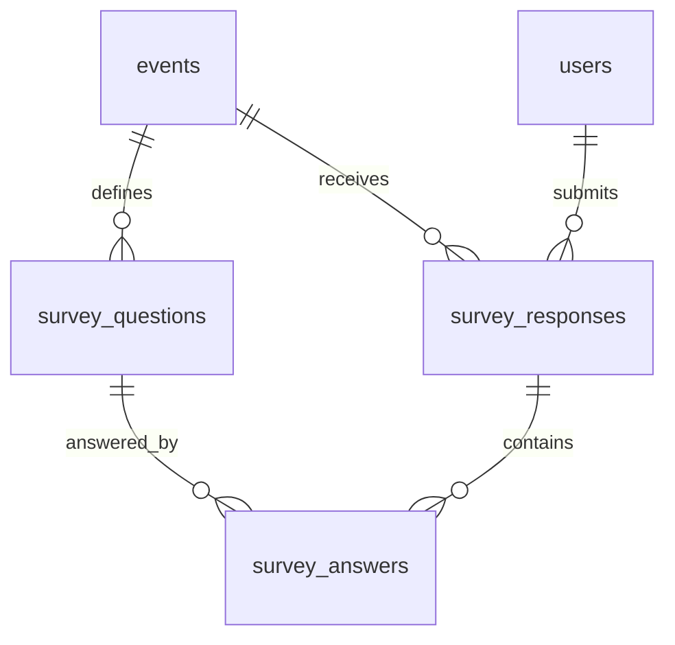

# 만족도 조사 커스터마이징 기능 추가 기획안 (Survey Customization Proposal)

본 문서는 비즈니스 매칭 시스템에서 각 행사별로 서로 다른 구성의 만족도 조사를 설계하고 배포할 수 있는 **행사별 만족도 조사 커스터마이징 기능**에 대한 기획 및 설계 제안서입니다.

---

## 1. 기획 배경 및 요구사항 분석

### 1.1 배경
오프라인 비즈니스 매칭 행사는 성격(데모데이, 네트워킹, 1:1 투자 상담 등)에 따라 참가자(스타트업, 전문가)로부터 수집하고자 하는 피드백 항목이 다릅니다. 기존의 고정형 설문조사 방식은 행사별 특화 질문을 수집하지 못해 운영진이 외부 툴(Google 폼, Typeform 등)을 혼용하여 데이터를 수집해야 하는 한계가 존재합니다.

### 1.2 핵심 요구사항
1. **행사별 독립된 구성**: 각 행사마다 설문조사 문항을 자유롭게 커스터마이징할 수 있어야 합니다.
2. **다양한 문항 유형 지원**:
   - 객관식 단일 선택 (Radio)
   - 객관식 복수 선택 (Checkbox)
   - 주관식 단답형 (Short Text)
   - 주관식 서술형 (Long Text)
   - 평점/별점 척도형 (Rating, 1~5점)
3. **설문 대상 구분**: 하나의 행사 내에서도 **스타트업 대상 문항**과 **전문가 대상 문항**을 다르게 구성할 수 있어야 합니다.
4. **데이터 추출 및 시각화**: 수집된 설문 데이터를 관리자가 대시보드에서 시각적으로 확인하고, Excel/CSV 파일로 일괄 다운로드할 수 있어야 합니다.

---

## 2. 데이터베이스 스키마 설계안

기존의 고정형 테이블(`satisfaction_surveys`) 구조를 탈피하고, 유연한 설문 문항 정의와 답변 수집을 지원하기 위해 **1(설문문항) : N(답변)** 및 **1(설문이력) : N(답변)** 관계로 확장합니다.



### 2.1 신규 테이블 DDL 제안

#### A. `survey_questions` (설문 문항 테이블)
행사별로 설정된 만족도 조사 질문들의 정보를 담습니다.
```sql
CREATE TABLE survey_questions (
    id UUID PRIMARY KEY DEFAULT gen_random_uuid(),
    event_id UUID NOT NULL REFERENCES events(id) ON DELETE CASCADE,
    target_role VARCHAR(50) NOT NULL CHECK (target_role IN ('STARTUP', 'EXPERT', 'ALL')),
    question_type VARCHAR(50) NOT NULL CHECK (question_type IN ('SINGLE_CHOICE', 'MULTIPLE_CHOICE', 'SHORT_ANSWER', 'LONG_ANSWER', 'RATING')),
    title TEXT NOT NULL,
    description TEXT, -- 문항 보조 설명
    options JSONB, -- 객관식용 선택지 배열 (예: ["매우 만족", "만족", "보통", "불만족", "매우 불만족"])
    is_required BOOLEAN NOT NULL DEFAULT TRUE,
    order_no INT NOT NULL DEFAULT 0,
    created_at TIMESTAMP WITH TIME ZONE DEFAULT CURRENT_TIMESTAMP,
    updated_at TIMESTAMP WITH TIME ZONE
);

-- 성능 최적화를 위한 인덱스
CREATE INDEX idx_survey_questions_event_role ON survey_questions (event_id, target_role, order_no);
```

#### B. `survey_responses` (설문 제출 마스터 테이블)
참가자가 특정 행사에 대한 만족도 조사를 최종 제출한 마스터 이력입니다. 행사당 1회 제출 제약조건을 담당합니다.
```sql
CREATE TABLE survey_responses (
    id UUID PRIMARY KEY DEFAULT gen_random_uuid(),
    event_id UUID NOT NULL REFERENCES events(id) ON DELETE CASCADE,
    user_id UUID NOT NULL REFERENCES users(id) ON DELETE CASCADE,
    user_role VARCHAR(50) NOT NULL CHECK (user_role IN ('STARTUP', 'EXPERT')),
    submitted_at TIMESTAMP WITH TIME ZONE DEFAULT CURRENT_TIMESTAMP,
    CONSTRAINT unique_event_user_response UNIQUE (event_id, user_id)
);

CREATE INDEX idx_survey_responses_event ON survey_responses (event_id);
```

#### C. `survey_answers` (문항별 답변 테이블)
제출된 설문지에 포함된 개별 문항들의 구체적인 답변 데이터입니다.
```sql
CREATE TABLE survey_answers (
    id UUID PRIMARY KEY DEFAULT gen_random_uuid(),
    response_id UUID NOT NULL REFERENCES survey_responses(id) ON DELETE CASCADE,
    question_id UUID NOT NULL REFERENCES survey_questions(id) ON DELETE CASCADE,
    answer_text TEXT, -- 주관식/서술형 응답 텍스트
    answer_rating INT CHECK (answer_rating BETWEEN 1 AND 5), -- 평점형 응답 값
    answer_selections JSONB, -- 객관식(단일/복수) 선택 결과 배열 (예: ["바이오", "친환경"])
    created_at TIMESTAMP WITH TIME ZONE DEFAULT CURRENT_TIMESTAMP,
    CONSTRAINT unique_response_question UNIQUE (response_id, question_id)
);
```

---

## 3. 관리자(Admin) 설문조사 빌더 UI/UX 기획

관리자가 행사 상세 대시보드 내에서 설문조사를 구성하고 결과를 조회하는 기능적 명세입니다.

### 3.1 만족도조사 설정 화면 (DRAFT, BOOKING, ALLOCATION 단계에서 편집 가능)
- **탭 구조**: `[스타트업용 만족도 조사]`와 `[전문가용 만족도 조사]`를 분리하여 서로 다른 문항을 구성할 수 있게 합니다.
- **템플릿 빠른 로드**: "기본 설문 템플릿 불러오기" 버튼을 제공하여, 사전에 정의된 공통 문항(예: 전반적 만족도, 매칭 만족도, 주관식 코멘트)을 원클릭으로 기본 로드합니다.
- **문항 추가/편집기 (Interactive Builder)**:
  - **문항 타입 셀렉터**: 5가지 타입 중 하나 선택.
  - **질문 제목 & 보조 텍스트 입력창**.
  - **객관식 선택지 관리**: 
    - 텍스트 필드를 동적으로 추가/삭제(`+`, `-` 버튼).
    - 각 선택지의 정렬 순서를 드래그 앤 드롭으로 조정.
  - **필수 여부 토글 스위치** (`is_required`).
  - **문항 순서 조정**: 문항 카드의 핸들을 잡고 드래그하거나 `▲` / `▼` 버튼을 이용하여 정렬 순서(`order_no`)를 즉시 반영.

### 3.2 만족도조사 결과 리포트 화면 (PROGRESS, FINISHED 단계)
- **응답률 대시보드**: `전체 제출 인원 / 전체 참가 인원 (제출률 %)`을 스타트업/전문가별로 실시간 집계하여 상단에 배치합니다.
- **질문별 응답 통계 시각화**:
  - **평점/별점형**: 5점 만점 기준 평균 평점 산출 및 1점~5점 분포 막대 그래프 표시.
  - **객관식(단일/복수)**: 선택지별 응답 비율을 원형(Pie) 또는 도넛(Donut) 차트로 시각화.
  - **주관식/서술형**: 최근 응답순으로 주관식 답변 내용을 카드 목록 형태로 카드 슬라이더 또는 스크롤 리스트로 제공.

---

## 4. 참가자(스타트업/전문가) 설문 응답 UI/UX 기획

모바일 뷰를 최우선으로 고려한 설문지 제출 인터페이스입니다.

### 4.1 진입 배너 및 알림
- 행사의 상태가 `FINISHED`로 전환되면, 참가자 로그인 대시보드 상단에 메인 브랜드 컬러인 **선명한 레드(`#E22213`)** 계열의 강조 배너를 노출합니다:
  > "행사가 공식 종료되었습니다. 더 나은 매칭 행사를 위해 1분 만족도 조사에 응해 주세요!"
- 미작성 상태에서는 특정 중요 메뉴(예: 매칭 리포트 보기, 최종 전문가 상담 카드 열람 등) 진입 시 만족도 조사를 먼저 작성하도록 모달 팝업으로 유도할 수 있습니다.

### 4.2 모바일 최적화 입력 폼
- **터치 영역 극대화**: 라디오 버튼이나 체크박스의 선택 영역을 넓은 카드 블록 형태로 디자인하여, 오터치 없이 엄지손가락으로 쉽게 선택할 수 있도록 합니다.
- **별점 컴포넌트**: 별 아이콘 5개를 크게 배치하고 터치 및 드래그 동작을 부드럽게 지원합니다.
- **유효성 검사 (Form Validation)**:
  - 필수 문항 미입력 상태에서 제출 시도 시, 입력이 빠진 문항으로 부드럽게 스크롤 이동(Smooth Scroll)시키고 붉은색 강조선과 경고 텍스트를 노출합니다.
- **중복 제출 방지**: 제출 버튼 클릭 시 비동기 로딩 스피너를 보여주며 버튼을 비활성화하고, Supabase의 Unique 제약 조건을 통해 중복 처리를 데이터베이스 단에서 완전 차단합니다.

---

## 5. 결과 데이터 다운로드 및 엑셀 포맷 설계

관리자가 외부 보고 및 분석용으로 모든 설문 데이터를 한 번에 다운로드할 수 있는 엑셀 레이아웃 기획입니다.

- **엑셀 시트 분리**: `[스타트업 만족도 조사 결과]`와 `[전문가 만족도 조사 결과]`를 별도 시트로 분리합니다.
- **행/열 구성**:
  - **행 (Rows)**: 참가자 1명의 설문 응답 건.
  - **열 (Columns)**: `제출 시각`, `참가자 ID`, `기업명/소속기관`, `참가자 성명`, `질문 1`, `질문 2`, ..., `질문 N`.
- **복수 선택 답변 처리**: 복수 선택형 문항의 경우, 선택한 옵션들을 쉼표(`,`)나 줄바꿈으로 한 셀 안에 표시하여 사람이 직관적으로 읽을 수 있도록 변환 저장합니다.

---

## 6. 기존 데이터 마이그레이션 및 하위 호환 전략

현재 로컬/라이브 환경에 반영된 기존 스키마 및 프론트엔드 코드와의 정합성을 유기적으로 유지하기 위한 단계적 마이그레이션 방안입니다.

### 6.1 기존 `satisfaction_surveys` 데이터 보존 전략
- **단계 1: 신규 테이블 생성**: `survey_questions`, `survey_responses`, `survey_answers` 테이블을 마이그레이션 SQL(`0025_survey_customization.sql`)로 생성합니다.
- **단계 2: 데이터 이전(Data Migration) 스크립트 작성**:
  기존 `satisfaction_surveys`에 들어있는 레코드들을 다음과 같이 신규 3개 테이블에 맞춰 변환하여 삽입하는 SQL/스크립트를 실행합니다.
  1. 기존 만족도 조사(종합, 매칭, 운영, 재참여, 의견)를 담당할 **공통/레거시용 기본 질문 5개**를 `survey_questions`에 미리 생성합니다.
  2. 기존 만족도 데이터의 행 하나당 `survey_responses` 레코드를 하나 생성합니다.
  3. 기존 행의 `rating_overall`, `rating_matching`, `rating_operation`, `rating_reparticipation`, `comment` 값을 각각 1번에서 생성한 매핑 질문의 `survey_answers` 레코드로 분할 삽입(Pivot-to-Rows)합니다.
- **단계 3: 레거시 테이블 안전 삭제**: 데이터 검증 완료 후 기존 `satisfaction_surveys` 테이블을 `DROP` 처리하거나 Deprecated 주석 처리합니다.

### 6.2 프론트엔드 API 클라이언트 호환성 유지
- 기존 `useSatisfaction` 훅 및 `SatisfactionPanel` 컴포넌트가 새로운 API/RPC 호출을 바라보도록 변경합니다.
- 동적 설문 구조이므로, 고정 필드 매핑 코드를 질문 목록을 가져온 후 동적으로 폼 스키마를 구성하는 **React Hook Form** 동적 제어로 수정합니다.

---

## 7. 향후 추가 고려 사항 (Advanced Features)

1. **상담 건별 별도 만족도 평가**: 행사 종료 후 전체 만족도 조사 외에, 각각의 '상담 세션'이 끝날 때마다 상대방(전문가 ↔ 스타트업)을 간단히 별점 3문항 정도로 평가할 수 있는 "세션 만족도 조사" 확장성 확보.
2. **익명(Anonymous) 설문 허용 여부**: 개인 식별을 원치 않는 피드백 수집을 위해 행사별로 `allow_anonymous_survey` 옵션을 추가하는 것 고려. (단, 1인 1회 제한을 위해 JWT/IP/세션 해시 기반의 간접 제약 필요).
3. **분석 리포트 PDF 출력**: 종합된 설문 차트 보고서를 관리자가 바로 인쇄하거나 PDF로 저장할 수 있는 브라우저 인쇄 전용 CSS 스타일링 지원.
